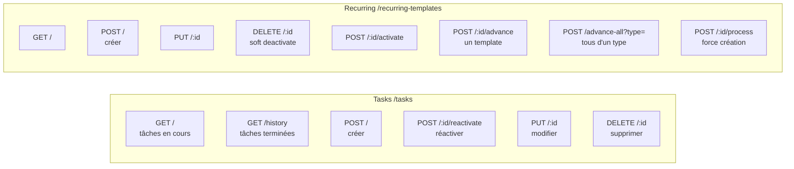

# Référence des endpoints REST

## Tâches — `/tasks`

| Méthode | Route | Description |
|---|---|---|
| `GET` | `/tasks` | Tâches en cours (status `Pending`) |
| `GET` | `/tasks/history` | Tâches terminées ou annulées |
| `POST` | `/tasks` | Créer une tâche `{title, duration, tags}` |
| `PUT` | `/tasks/:id` | Modifier une tâche |
| `DELETE` | `/tasks/:id` | Supprimer définitivement |
| `POST` | `/tasks/:id/reactivate` | Remettre en `Pending` depuis l'historique |

## Récurrences — `/recurring-templates`

| Méthode | Route | Description |
|---|---|---|
| `GET` | `/recurring-templates` | Tous les templates de l'utilisateur |
| `POST` | `/recurring-templates` | Créer un template `{title, recurrenceType, …}` |
| `PUT` | `/recurring-templates/:id` | Modifier un template |
| `DELETE` | `/recurring-templates/:id` | Désactivation douce (`IsActive = false`) |
| `POST` | `/recurring-templates/:id/activate` | Réactiver un template |
| `POST` | `/recurring-templates/:id/advance` | Passer manuellement au cycle suivant |
| `POST` | `/recurring-templates/advance-all?type=` | Avancer tous les templates d'un type (`Daily` / `Weekly` / `Monthly`) |
| `POST` | `/recurring-templates/:id/process` | Forcer la création des tâches pour la période courante |

Tous les endpoints requièrent `Authorization: Bearer <access_token>`.

