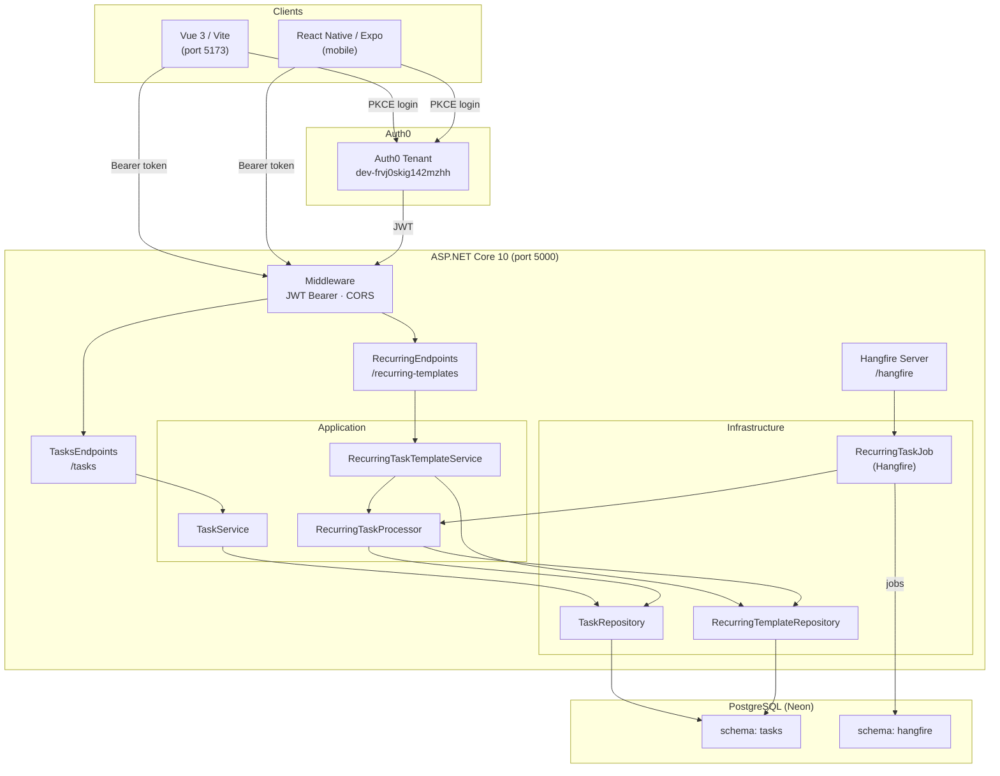

# Architecture générale

```mermaid
graph TB
    subgraph Clients
        WEB["Vue 3 / Vite\n(port 5173)"]
        MOB["React Native / Expo\n(mobile)"]
    end

    subgraph Auth0
        A0["Auth0 Tenant\ndev-frvj0skig142mzhh"]
    end

    subgraph API["ASP.NET Core 10 (port 5000)"]
        MW["Middleware\nJWT Bearer · CORS"]
        TE["TasksEndpoints\n/tasks"]
        RE["RecurringEndpoints\n/recurring-templates"]
        HF["Hangfire Server\n/hangfire"]

        subgraph Application
            TS["TaskService"]
            RTS["RecurringTaskTemplateService"]
            RTP["RecurringTaskProcessor"]
        end

        subgraph Infrastructure
            TR["TaskRepository"]
            RTR["RecurringTemplateRepository"]
            JOB["RecurringTaskJob\n(Hangfire)"]
        end
    end

    subgraph DB["PostgreSQL (Neon)"]
        TASKS["schema: tasks"]
        HFD["schema: hangfire"]
    end

    WEB -- "Bearer token" --> MW
    MOB -- "Bearer token" --> MW
    WEB -- "PKCE login" --> A0
    MOB -- "PKCE login" --> A0
    A0 -- "JWT" --> MW

    MW --> TE & RE
    TE --> TS --> TR --> TASKS
    RE --> RTS --> RTR --> TASKS
    RTS --> RTP --> TR & RTR
    HF --> JOB --> RTP
    JOB -- "jobs" --> HFD
```
