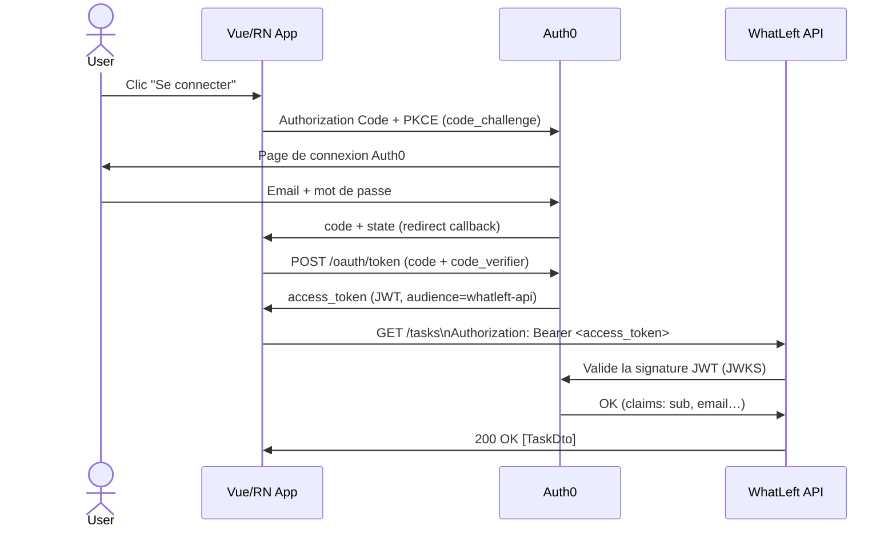

# Flux d'authentification Auth0

```mermaid
sequenceDiagram
    actor User
    participant Client as Vue/RN App
    participant Auth0
    participant API as WhatLeft API

    User->>Client: Clic "Se connecter"
    Client->>Auth0: Authorization Code + PKCE (code_challenge)
    Auth0->>User: Page de connexion Auth0
    User->>Auth0: Email + mot de passe
    Auth0->>Client: code + state (redirect callback)
    Client->>Auth0: POST /oauth/token (code + code_verifier)
    Auth0->>Client: access_token (JWT, audience=whatleft-api)

    Client->>API: GET /tasks\nAuthorization: Bearer <access_token>
    API->>Auth0: Valide la signature JWT (JWKS)
    Auth0->>API: OK (claims: sub, email…)
    API->>Client: 200 OK [TaskDto]
```
