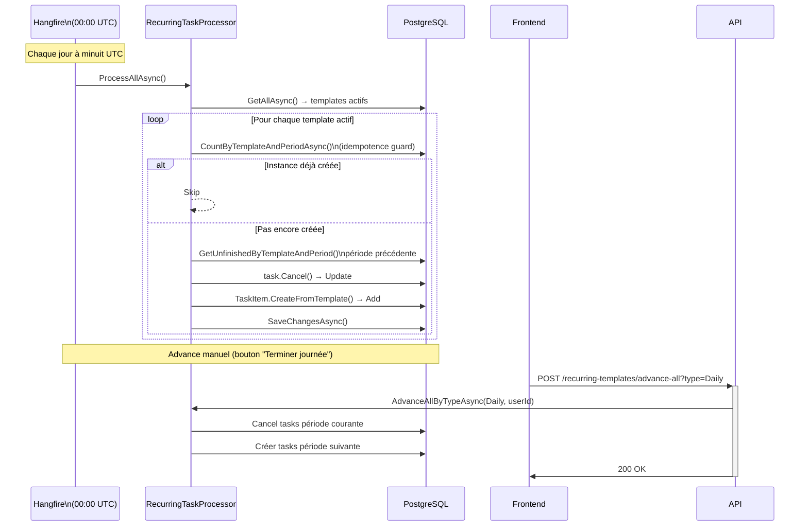

# Cycle de vie des récurrences

```mermaid
sequenceDiagram
    participant HF as Hangfire\n(00:00 UTC)
    participant RTP as RecurringTaskProcessor
    participant DB as PostgreSQL

    Note over HF: Chaque jour à minuit UTC
    HF->>RTP: ProcessAllAsync()
    RTP->>DB: GetAllAsync() → templates actifs

    loop Pour chaque template actif
        RTP->>DB: CountByTemplateAndPeriodAsync()\n(idempotence guard)
        alt Instance déjà créée
            RTP-->>RTP: Skip
        else Pas encore créée
            RTP->>DB: GetUnfinishedByTemplateAndPeriod()\npériode précédente
            RTP->>DB: task.Cancel() → Update
            RTP->>DB: TaskItem.CreateFromTemplate() → Add
            RTP->>DB: SaveChangesAsync()
        end
    end

    Note over HF,DB: Advance manuel (bouton "Terminer journée")
    participant Client as Frontend
    Client->>+API: POST /recurring-templates/advance-all?type=Daily
    API->>RTP: AdvanceAllByTypeAsync(Daily, userId)
    RTP->>DB: Cancel tasks période courante
    RTP->>DB: Créer tasks période suivante
    API->>-Client: 200 OK
```
